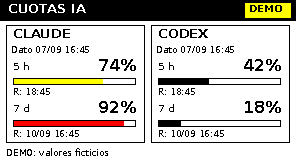

# iauso — AI quota on an e-ink display

*[Léeme en español](README.es.md)*

**iauso** ("IA · uso" — AI usage in Spanish) shows how much of your **Claude**
and **Codex** quota you have consumed, on an e-ink display attached to a
Raspberry Pi: percentage used, when each window resets, and whether a session
needs attention. No desktop, no heavy process running — a short refresh every
five minutes.

You can also read the same data from a web page or a Telegram bot (see
[docs/INTEGRATIONS.md](docs/INTEGRATIONS.md)), or keep the queries on a server
and let the display just read them.

Python adaptation of the usage queries from
[vinzdg/codenotch](https://github.com/vinzdg/codenotch). It was built for the
**Waveshare 2.15inch e-Paper HAT+ (G)** (**296 × 160**, black, white, red and
yellow) and that is the only panel tested on physical hardware. Since version
1.2 it also supports other common Waveshare panels (2.13", 2.9", 4.2", 7.5",
with and without a second color) by reusing their official drivers — see
[docs/PANELS.md](docs/PANELS.md). The official drivers are vendored, so there
is no need to download the whole Waveshare repository.



The display shows the **percentage used**, two quota windows per provider and
the reset date/time. Yellow from 70 %; red from 90 % — and both thresholds are
changed with `warn_percent`/`crit_percent` in `config.json`, without touching
code ([how](docs/CONFIGURATION.md#display)). The default timezone is
`America/Santiago`, with DST handled by the system timezone database.

## Where to start

| I want to... | Read |
|---|---|
| Understand what it does and set up the Raspberry Pi | This README, from [1. Assembly and installation](#1-assembly-and-installation) |
| **Change something** (colors, thresholds, windows, timings) | **[docs/CONFIGURATION.md](docs/CONFIGURATION.md)** — every option + copy-paste recipes |
| Use an e-ink panel other than the 2.15G | [docs/PANELS.md](docs/PANELS.md) |
| Keep the queries on a server with Docker | [docs/DOCKER_API.md](docs/DOCKER_API.md) |
| Same, but server and Raspberry Pi on different networks | [docs/DOCKER_DIFFERENT_NETWORKS.md](docs/DOCKER_DIFFERENT_NETWORKS.md) |
| A server without Docker, just Python + systemd | [docs/WITHOUT_DOCKER.md](docs/WITHOUT_DOCKER.md) |
| Read the quota from a web page or a Telegram bot | [docs/INTEGRATIONS.md](docs/INTEGRATIONS.md) |
| Know where the data comes from and what was tested | [docs/SOURCES.md](docs/SOURCES.md), [docs/VALIDATION.md](docs/VALIDATION.md) |

Spanish documentation lives in [docs/es/](docs/es/).

**New in 1.2:** more Waveshare panels, a configurable panel language (`language`, English by default), configurable color thresholds
(`warn_percent`/`crit_percent`), a Docker-free server, web/Telegram
integrations, CORS on the API, and `scripts/init_server.py --rotate-token`
to rotate the panel key without reinstalling.

## What it includes and what was tested

- Lightweight Python program on the Raspberry Pi, no graphical desktop.
- Claude and Codex queries, private cache and persistent backoff on HTTP 429.
- Receiver mode over SSH: credentials can stay on another computer.
- API mode: a permanent Docker server and HTTP/HTTPS reads from the Pi.
- PNG preview and DEMO mode, with no Internet and no accounts.
- Installer for Raspberry Pi OS, systemd service and timer.
- Automated tests for parsing, errors, staleness and the real four-color packing.
- Support for other common Waveshare panels besides the 2.15G (see
  [docs/PANELS.md](docs/PANELS.md); only the 2.15G is tested on hardware).
- Server and API without Docker, using systemd (see
  [docs/WITHOUT_DOCKER.md](docs/WITHOUT_DOCKER.md)).
- The API accepts CORS (`Access-Control-Allow-Origin: *`) and can be queried
  from a web page or a Telegram bot besides the display (see
  [docs/INTEGRATIONS.md](docs/INTEGRATIONS.md)).

**The software was tested with simulated responses and the official driver's
`getbuffer()` method. Your display was not tested physically and your accounts
were not queried.** The first test on the Raspberry Pi should be DEMO mode.

This version shows quota. It does not include the working/waiting agent
indicators, other providers, or the local activity monitor of the macOS app.

## Getting the project

On every machine where you will use it (the Raspberry Pi, and the server if you
use `api` mode), the folder must end up as `~/iauso/`.

With git:

```bash
cd ~
git clone https://github.com/YOUR_USER/iauso.git
cd iauso
```

Or, if you received the ZIP instead of the repository:

```bash
cd ~
python3 -m zipfile -e iauso.zip "$HOME"
cd iauso
```

To **update** an existing installation, `git pull` (or extracting the ZIP
again) is safe: your `config.json`, `secrets/` and `server-data/` are not
versioned and are left untouched.

### Coming from version 1.1 (`codenotch-eink`)

In 1.2 the project was renamed to **iauso**: the command, the systemd units and
the configuration and state folders all change name. On the Raspberry Pi,
`scripts/install_pi.sh` migrates on its own: it disables and removes the old
units, moves `~/.config/codenotch-eink` and `~/.local/state/codenotch-eink` to
their new names (keeping the panel key and the state) and fixes the paths left
inside your `config.json`, leaving a copy in `config.json.bak`.

```bash
cd ~/iauso                     # the new project, next to the old one
cp ~/codenotch-eink/config.json .
bash scripts/install_pi.sh
sudo systemctl enable --now iauso.timer
python3 -m iauso doctor --config config.json
```

Once `doctor` answers correctly you can delete `~/codenotch-eink`.

On the Docker server the Compose project and image also change name: bring the
old stack down (`docker compose -p codenotch-eink down`) before starting the new
one, and move `.env`, `secrets/` and `server-data/` to the new folder to keep
your sessions and key.

## 1. Assembly and installation

You need Raspberry Pi OS Lite with Python 3.9 or newer, a microSD, Wi-Fi
configured, stable power and the 40-pin GPIO header installed. For a fresh
install, 64-bit Raspberry Pi OS Lite also lets you evaluate the official ARM64
CLIs. The display program also works on a compatible 32-bit system.

1. **Power off and unplug the Raspberry Pi before mounting the HAT.** Align pin
   1 and seat the 40-pin connector. By default the program expects a
   **2.15 / G**; if your panel is a different one (2.13", 2.9", 4.2", 7.5"...)
   set it with `"panel"` in `config.json` — see [docs/PANELS.md](docs/PANELS.md)
   before continuing.
2. Put the project in the Raspberry Pi's home folder (see
   [Getting the project](#getting-the-project)). It must end up as
   `~/iauso/README.md`.
3. Connect over SSH and run, as your regular user:

```bash
cd ~/iauso
bash scripts/install_pi.sh
sudo reboot
```

The installer uses `sudo` to install Raspberry Pi OS packages, enable SPI,
assign the `gpio`/`spi` groups and create the systemd units. It does not start
querying yet. The install path must be kept, because the service uses it. If
you move the folder, run the installer again.

The program uses the **SPI0, CE0** bus, which shows up as `/dev/spidev0.0`. All
supported panels (see [docs/PANELS.md](docs/PANELS.md)) use the same standard
Waveshare BCM assignment:

| Signal | GPIO BCM | Physical pin |
|---|---:|---:|
| MOSI / DIN | 10 | 19 |
| SCLK / CLK | 11 | 23 |
| CS | 8 | 24 |
| DC | 25 | 22 |
| RST | 17 | 11 |
| BUSY | 24 | 18 |
| PWR control | 18 | 12 |

With the HAT mounted directly you do not need to wire these signals. The table
describes the driver; follow the Waveshare manual for a wired connection and
for power.

## 2. First display test

After the reboot, connect over SSH again:

```bash
cd ~/iauso
python3 -m iauso doctor --config config.json
python3 -m iauso refresh --config config.json --demo
```

You will see a panel with the **DEMO** label and fictional values. A full
refresh of this display is slow: it may flash and take around 20 seconds. When
it finishes, the program puts the controller to sleep and the image stays
visible.

Do not run examples from other panels. The program enforces **180 seconds
between refresh attempts**, even after restarting it. If you run two tests in a
row, the second may report `deferred`: wait for that interval to pass. If the
image did not change it reports `unchanged`; even so it schedules a maintenance
refresh roughly daily while the service is enabled.

To flip the panel, change `"rotation": 0` to `"rotation": 180` in `config.json`.

## 3. Choose where the quota comes from

| Mode | Where the quota is queried | Where the credentials stay |
|---|---|---|
| `local` | On the Raspberry Pi, using whatever sessions exist there | On the Pi |
| `file` | On a computer; it pushes a JSON to the Pi over SSH | On that computer |
| `api` | On a Docker server; the Pi reads `GET /v1/usage` | On the server |

**For an always-on server, use `api` and follow
[docs/DOCKER_API.md](docs/DOCKER_API.md).** The `file` mode also lets you reuse
the sessions of the computer where you already work with the CLIs. In that case
the computer must be powered on and connected to update. Both modes avoid
installing the AI tools on the Raspberry Pi.

Detailed setup for each mode — receiver over SSH, local queries on the Pi,
macOS keychain, `CLAUDE_CONFIG_DIR`/`CODEX_HOME`, session renewal — is
documented in [the Spanish README](README.es.md#3-elige-de-dónde-vendrán-las-cuotas)
and in [docs/DOCKER_API.md](docs/DOCKER_API.md).

## 4. Start automatic updates

With the display tested and one of the modes configured:

```bash
cd ~/iauso
python3 -m iauso refresh --config config.json
sudo systemctl enable --now iauso.timer
```

The timer runs a short process roughly every five minutes; it does not leave a
graphical process eating memory. After a reboot it starts automatically. With
receiver mode there is also the lag between the push and the read; they are two
independent cycles.

Operating commands:

```bash
systemctl list-timers iauso.timer
journalctl -u iauso.service -n 50 --no-pager
sudo systemctl start iauso.service
sudo systemctl disable --now iauso.timer
```

If you change `poll_seconds`, run the installer again to regenerate the timer
and then `sudo systemctl restart iauso.timer`. Changing only the JSON does not
change the systemd interval. Never lower the rest limits to force an animation
on this display.

## What the data means

| Indicator | Meaning |
|---|---|
| `5 h`, `7 d` | Quota windows; for Codex the duration reported by the service is used |
| `74%` | Percentage of that window consumed, not remaining |
| `R:` | Local reset date/time reported by the provider |
| `Dato DD/MM HH:MM` | Last successful query for that provider |
| `INICIAR SESION` / `RENOVAR SESION` | A readable session is missing or has expired |
| `SIN CONEXION` / `ANT.` / asterisk | Previous reading; not presented as freshly queried |
| `ESPERAR / 429` | Wait demanded by the provider; kept across runs |
| `Sin dato` | Quota not reported; never replaced by 0 % |
| `R: por confirmar` | The reset date passed; a new reading is needed to know the usage |

> The panel text is English by default and switches with `"language": "es"` in
> `config.json`. The strings live in `iauso/i18n.py`; adding a language means
> copying a block and translating the values. Logs and error messages are always
> English.

By default the panel shows the session and the general weekly quota. The JSON
keeps the other windows reported by Claude. To show, for example, the weekly
Sonnet quota, change `claude_windows` to `["session", "weekly_sonnet"]`. If the
provider does not report that quota, `Sin dato` appears.

**Claude:** reads the subscription quota returned by the Claude Code endpoint.
**Codex:** reads the main Codex quota tied to the ChatGPT account; it is not a
global meter of every ChatGPT Pro feature. This program does not use a
pay-per-token API key.

Both queries reuse internal service interfaces, as Codenotch does. They may
change schema or reject access. The existence of this code does not guarantee
endpoint availability for every account.

**Session renewal:** like Codenotch, the monitor only reads tokens. It does not
renew or modify them. When they expire it shows `RENOVAR SESION`; open the
corresponding official tool so it renews its session. That is why we do not
promise an indefinitely autonomous Raspberry Pi with a copy of credentials.

## Preview without a Raspberry Pi

```bash
python3 -m pip install -r requirements-preview.txt
python3 -m iauso preview --demo --output panel.png
python3 -m unittest discover -s tests -v
```

`--demo` never reads credentials nor makes queries. DEMO data is also rejected
as a real snapshot in receiver mode.

## Troubleshooting

- **`/dev/spidev0.0` does not exist:** check SPI in `sudo raspi-config`, reboot
  and confirm it was not disabled in the boot configuration.
- **Permission denied on GPIO/SPI:** log in again after the installer; check
  `id` and the `gpio` and `spi` groups. For manual tests you can use
  `GPIOZERO_PIN_FACTORY=lgpio python3 -m iauso refresh --config config.json --demo`.
- **BUSY never releases or the screen stays blank:** stop the timer, power off
  the Pi, check the panel model, the alignment and the power supply. The driver
  has a maximum wait. Do not repeat refreshes continuously.
- **Readable session but HTTP 401/403:** open the official tool to renew or sign
  in. `doctor` verifies local reading, not that the server accepts the session.
  An API key or a browser-only session does not replace that subscription session.
- **Nothing changes after renewing a session:** wait for the next cycle; queries
  respect the persisted deadline. HTTP 429 may require waiting more than five
  minutes.
- **Intermittent `SIN CONEXION` on Wi-Fi:** Raspberry Pi OS enables Wi-Fi power
  save by default, and the radio may sleep between cycles. Check with
  `iw dev wlan0 get power_save`; to disable it permanently create
  `/etc/NetworkManager/conf.d/99-wifi-powersave-off.conf` with
  `[connection]` / `wifi.powersave = 2` and restart NetworkManager.
- **The JSON never arrives:** test SSH with the same user/alias as the collector.
  Automatic push needs a key without interaction and the computer powered on.
  After 15 minutes without fresh data it is marked as stale.
- **API mode fails:** run `doctor --config config.json`, check the final URL and
  the panel key. HTTP 401 from this API is not the same as an expired provider
  session. Check the `collector` logs on the server. The API serves cached data
  and does not query providers on every request.
- **Wrong date or time:** check `timedatectl status` and enable synchronization
  with `sudo timedatectl set-ntp true`. Keep `tzdata` up to date.
- **Corrupted state:** stop the timer and wait at least three minutes since the
  last refresh attempt. Rename `~/.local/state/iauso/state.json` to
  `state.backup.json`, look into the problem and start the timer again. That
  recovery drops the cache and the backoff deadlines: do not use it to skip an
  HTTP 429.
- **The service exits:** `Type=oneshot` finishes after each reading; it is normal
  for it not to stay `active (running)`. Check the timer and the logs.

## Layout and references

`iauso/` holds the query, state, rendering and display modules.
`vendor/waveshare_epd/` holds the official Waveshare files.
`scripts/` installs dependencies and generates systemd units.
`tests/` verifies the software without hardware or accounts.

See [docs/SOURCES.md](docs/SOURCES.md) for the exact commits and origins. The
original Codenotch MIT license is kept in `LICENSE-CODENOTCH`; the Waveshare
files keep their own license notice. This adaptation ships under the MIT
license in `LICENSE`.
