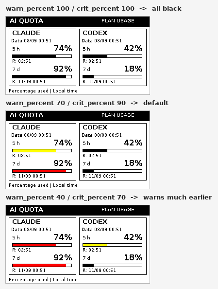

# `config.json` reference

Every option, its default and what it does. The file is plain JSON: you only
need to write the options you want to change, everything else takes its default.
An unknown option name fails at startup on purpose, so a typo does not pass
silently.

The defaults live in `iauso/config.py`, in the `DEFAULT` dictionary — that is
the place to look when in doubt.

## Data source

| Option | Default | Values | What it does |
|---|---|---|---|
| `source` | `"local"` | `local`, `file`, `api` | Where the quota comes from: read here, received over SSH, or queried from your server |
| `api_url` | `""` | URL ending in `/v1/usage` | Only with `source: "api"`. Rejected if it has a query, fragment or user/password |
| `api_token_file` | `"~/.config/iauso/api-token"` | path | Panel key; 32 to 128 URL-safe characters |
| `api_allow_http` | `false` | `true`/`false` | Allow unencrypted `http://`. Leave it `false` except on a trusted LAN |
| `snapshot_file` | `"~/.local/state/iauso/inbox.json"` | path | Only with `source: "file"`: the JSON the collector pushes over SSH |
| `state_dir` | `"~/.local/state/iauso"` | path | Cache, state and `preview.png`. Must be writable by the service user |

## Display

| Option | Default | Values | What it does |
|---|---|---|---|
| `language` | `"en"` | `en`, `es` | Language of the text on the panel (`AI QUOTA` / `CUOTAS IA`, `NO CONNECTION` / `SIN CONEXION`...). It does not affect logs or error messages, which are always English |
| `display` | `"epd"` | `epd`, `png` | `epd` draws on the physical panel; `png` only saves the image in `state_dir` (useful for testing without hardware) |
| `panel` | `"2.15g"` | see [PANELS.md](PANELS.md) | Waveshare panel model. Defines resolution and available colors |
| `rotation` | `0` | `0`, `180` | Flip the image if you mounted the panel upside down |
| `warn_percent` | `70` | `0` to `100` | From this usage the bar switches to the warning color |
| `crit_percent` | `90` | `0` to `100`, >= `warn_percent` | From this usage the bar switches to the critical color |

The same panel with three threshold settings (same data: 74 % and 92 % on
Claude, 42 % and 18 % on Codex):



Which colors are used depends on what the panel can paint:

| Panel mode | Below `warn_percent` | From `warn_percent` | From `crit_percent` |
|---|---|---|---|
| `mono` (2.13, 2.9, 4.2, 7.5) | black | black | black |
| `duo` (2.13b, 2.9b, 7.5b) | black | ink color | ink color |
| `quad` (2.15g) | black | yellow | red |

A monochrome panel cannot change color: the thresholds do not break it, they
simply are not visible. A "duo" panel has a single color besides black, so
`warn_percent` and `crit_percent` look the same as each other.

## Quota windows

| Option | Default | What it does |
|---|---|---|
| `claude_windows` | `["session", "weekly_all"]` | The **two** Claude windows to show |
| `codex_windows` | `["primary", "secondary"]` | The **two** Codex windows to show |

Available identifiers:

- **Claude:** `session` (5 h), `weekly_all` (7 d), `weekly_opus`, `weekly_sonnet`
- **Codex:** `primary`, `secondary`

Always exactly two per provider (that is what fits the layout). If the provider
does not report that window, `Sin dato` is shown instead of a made-up 0 %.

## Accounts

| Option | Default | What it does |
|---|---|---|
| `claude.enabled` / `codex.enabled` | `true` | Set to `false` to hide that provider; with `false` its credentials are not even read |
| `claude.credentials_file` | `""` | Explicit path. Empty uses `~/.claude/.credentials.json` (honors `CLAUDE_CONFIG_DIR` in a terminal) |
| `codex.credentials_file` | `""` | Empty uses `~/.codex/auth.json` (honors `CODEX_HOME`) |
| `claude.keychain_service` | `""` | macOS only: keychain service name, e.g. `"Claude Code-credentials"` |

The systemd service does **not** inherit your terminal's environment: if you use
profiles with `CLAUDE_CONFIG_DIR` or `CODEX_HOME`, put explicit paths here.

## Timings

| Option | Default | Range | What it does |
|---|---|---|---|
| `poll_seconds` | `300` | 300 to 86400 | How often it queries. Changing it requires running `install_pi.sh` again to regenerate the systemd timer |
| `min_refresh_seconds` | `180` | 180 to 86400 | Minimum between physical panel refreshes. **Do not lower it**: it is the limit protecting the e-ink display |
| `stale_after_seconds` | `900` | 300 to 86400 | After this long without a good reading, data is marked stale |
| `http_timeout_seconds` | `15` | 1 to 30 | Maximum wait per HTTP request |
| `busy_timeout_seconds` | `60` | 20 to 90 | Maximum wait for the panel to release BUSY before aborting |
| `timezone` | `"America/Santiago"` | IANA zone | Timezone for the reset times shown |

---

# Recipes

Concrete, copy-paste changes. After editing `config.json`:

```bash
python3 -m iauso doctor --config config.json     # validates the config
python3 -m iauso preview --config config.json --demo --output preview.png
```

`preview` touches neither the hardware nor the accounts: use it to see the
result before spending a panel refresh.

### Change when the bar changes color

Warn earlier (yellow from 50 %, red from 80 %):

```json
{
  "warn_percent": 50,
  "crit_percent": 80
}
```

Warn only when little is left:

```json
{
  "warn_percent": 85,
  "crit_percent": 95
}
```

To keep the bars almost always black, set both thresholds to `100`: they will
only take color at exactly 100 % usage.

If you also want **different colors** (not just different thresholds), that is a
code change: `ACCENTS` in `iauso/render.py`. Keep in mind an e-ink panel can
only paint the colors of its physical ink — putting blue on a black/white/red
panel will not work.

### Put the panel in Spanish

```json
{
  "language": "es"
}
```

The display then shows `CUOTAS IA`, `SIN CONEXION`, `RENOVAR SESION` and so on.
Logs and error messages stay in English.

To add another language, copy a block in `iauso/i18n.py` and translate the
values, keeping the keys. A test checks every language defines the same keys, so
a missing translation fails the suite instead of showing up as a blank on the
panel.

### Show the weekly Sonnet quota instead of the general one

```json
{
  "claude_windows": ["session", "weekly_sonnet"]
}
```

### Show a single provider

```json
{
  "codex": {"enabled": false}
}
```

The Codex column shows the `DESACTIVADO` label and its credentials file is not
read.

### Test everything without the panel connected

```json
{
  "display": "png"
}
```

Each cycle saves `preview.png` in `state_dir` instead of drawing. Useful to
leave it running on a server and check the image over SSH, or to develop the
layout.

### Mount the panel upside down

```json
{
  "rotation": 180
}
```

### Query every 10 minutes instead of every 5

```json
{
  "poll_seconds": 600
}
```

On the Raspberry Pi, additionally:

```bash
bash scripts/install_pi.sh          # regenerates the systemd unit
sudo systemctl restart iauso.timer
```

Changing only the JSON does not change the systemd interval — the timer is
generated from `poll_seconds` at install time.
